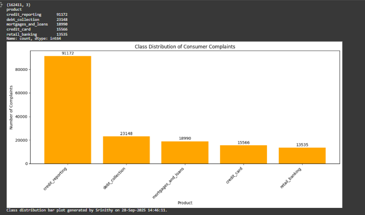
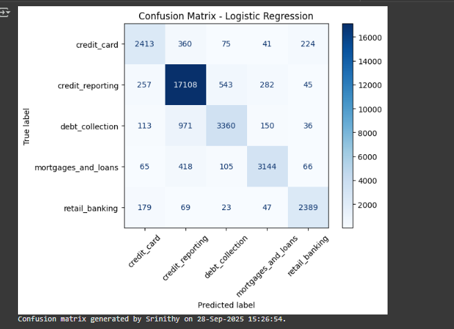
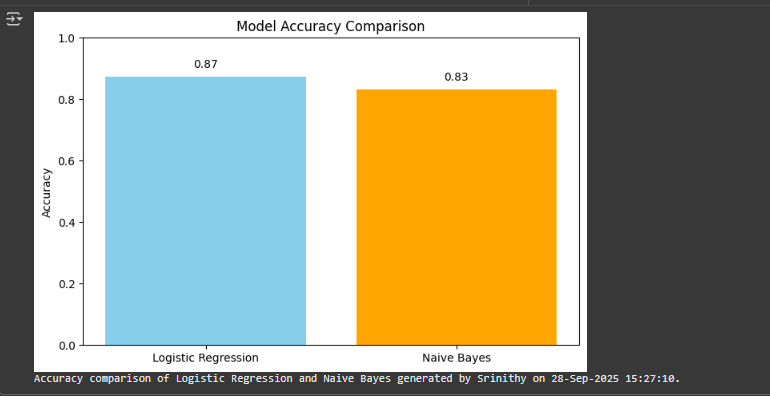

# Task 5: Consumer Complaint Text Classification  

**Submitted by:** Srinithy S  
**Date:** 28-Sep-2025  

---

## 📌 Project Overview  
This project performs **text classification** on consumer complaint data using machine learning.  
The complaints are classified into the following categories:  
- 0 → Credit Reporting  
- 1 → Debt Collection  
- 2 → Consumer Loan  
- 3 → Mortgage  

**Key Features:**  
- Data cleaning & preprocessing  
- TF-IDF feature extraction  
- Multi-class classification (Logistic Regression, Naive Bayes)  
- Evaluation metrics: accuracy, classification report, confusion matrix  
- Visualizations: class distribution, word clouds  

---

## 💻 Installation

1. **Run the notebook**:

> You can open and run the notebook directly in Google Colab without installing anything:  
[Open Task5.ipynb in Google Colab](https://colab.research.google.com/github/Sri-0405/Task_5/blob/main/src/Task5.ipynb)

2. Screenshots

Here are the screenshots for the task:

  
  

---

